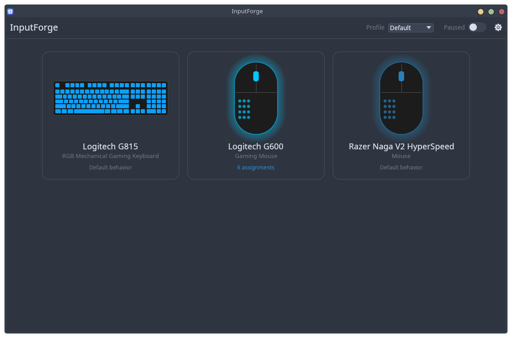
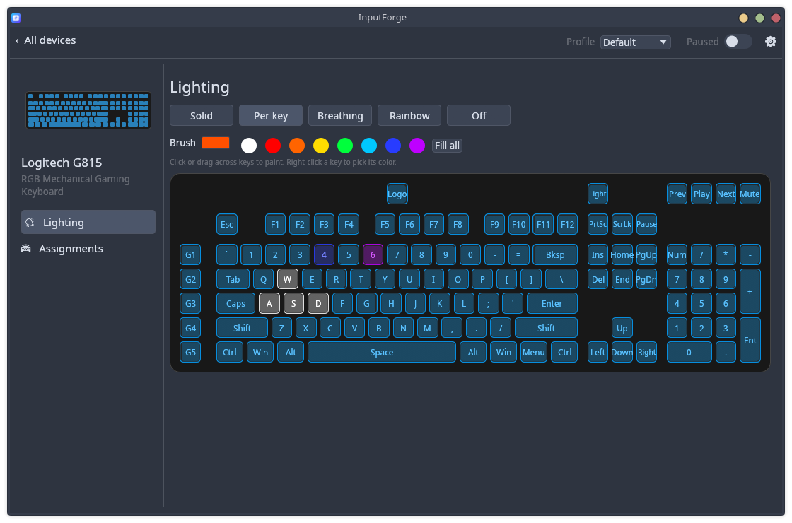
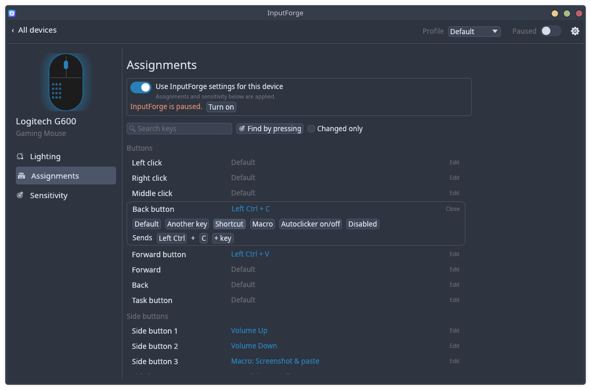
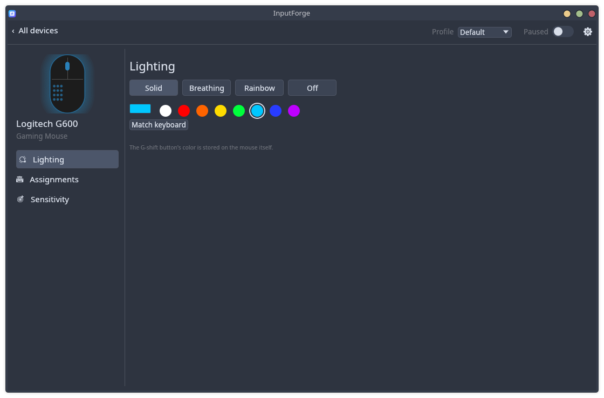
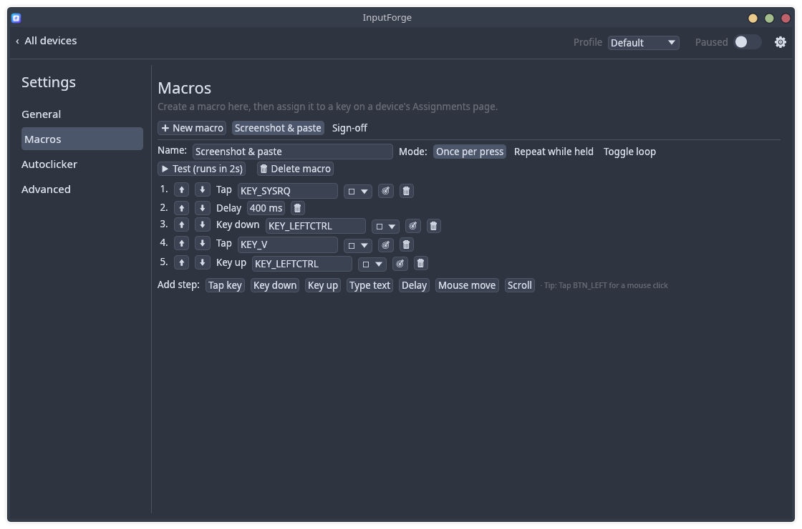
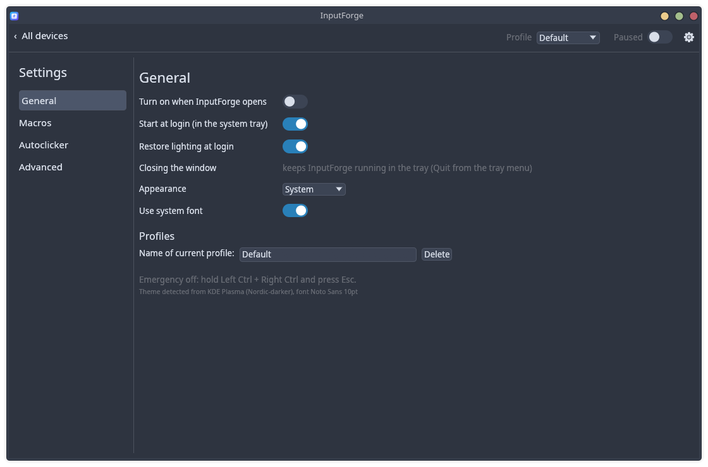

<p align="center"></p>

# InputForge

Keyboard and mouse control for Linux, in the style of Logitech G HUB, written in Rust. It works
at the kernel level (evdev + uinput), so remaps work the same on Wayland (KDE, Hyprland, GNOME),
X11, and in games.



## Screenshots

| | |
|---|---|
|  |  |
| **Per-key lighting:** click or drag to paint keys on the G815 | **Assignments:** every button with its current function; click to change |
|  |  |
| **Mouse lighting:** solid, breathing, rainbow, or match the keyboard | **Macros:** taps, held keys, typed text, delays and mouse moves |
|  | |
| **Settings:** start at login in the tray, restore lighting, theme | |

## Features

- **Devices at a glance.** The home screen shows one card per keyboard and mouse. Click a card
  for its **Lighting**, **Assignments** and **Sensitivity** pages.
- **Assignments.** Every key or button the device has is listed with what it currently does.
  Click one to change it to another key, a shortcut (e.g. Ctrl+C), a macro, the autoclicker
  toggle, or nothing. *Find by pressing* jumps to a key when you press it. Profiles let you keep
  several sets of assignments.
- **Built-in RGB lighting** for the Logitech G815/G813 (per-key painting, solid, breathing,
  rainbow) and G600 (solid, breathing, rainbow). No OpenRGB or other tools are needed. The
  colours are restored at login.
- **Macros:** taps, key down/up, typed text, delays, mouse moves and scrolls. Each macro runs
  once per press, repeats while held, or loops until toggled off.
- **Autoclicker:** any button or key, 0.5–100 clicks/s, an optional click limit and a hotkey.
- **Sensitivity:** pointer and scroll speed per mouse, plus natural scrolling.
- **System tray.** Closing the window keeps everything running. Left-click the tray icon to
  open the window, middle-click to pause or resume, and use the menu to switch profiles or
  quit. You can also have it start at login.
- **Follows your desktop theme:** colours, light/dark mode, accent colour and fonts from KDE,
  GTK or the XDG portal.

**Emergency release:** press Left Ctrl + Right Ctrl + Esc to stop and let go of every device.

Settings → Advanced has the raw device list, a full rule editor, libratbag (DPI and polling for
other mice) and OpenRGB (other RGB devices).

## Install

### Arch / CachyOS / EndeavourOS

```bash
git clone https://github.com/mattlaughter/inputforge
cd inputforge/packaging/arch
makepkg -si
sudo usermod -aG input $USER     # then log out and back in
```

### Nobara / Fedora

```bash
sudo dnf install git rpm-build cargo rust gcc librsvg2-tools desktop-file-utils systemd-rpm-macros
git clone https://github.com/mattlaughter/inputforge
cd inputforge
packaging/rpm/build-rpm.sh
sudo dnf install ~/rpmbuild/RPMS/x86_64/inputforge-*.rpm
sudo usermod -aG input $USER     # then log out and back in
```

If the distro's Rust is older than 1.95, install rustup (`sudo dnf install rustup && rustup-init`)
and build with `packaging/rpm/build-rpm.sh --rustup`. The RPM build is fully offline because all
crates are vendored. `build-rpm.sh --srpm` makes a source RPM you can upload to Fedora COPR.

A ready-built Arch package is attached to each
[release](https://github.com/mattlaughter/inputforge/releases)
(`sudo pacman -U inputforge-*.pkg.tar.zst`).

### Any distro (from source)

```bash
cargo build --release
sudo ./install.sh     # binary to /usr/local/bin, udev rules, icons, menu entry, adds you to 'input'
```

## Why the `input` group?

InputForge reads your keyboards and mice from `/dev/input/event*` and creates virtual devices
through `/dev/uinput`. Both are restricted to the `input` group, and the packages add a udev
rule that grants it uinput access. The lighting rule gives the logged-in user access to the
supported Logitech devices' `hidraw` nodes.

## CLI

```bash
inputforge                  # open the window (or show the running one)
inputforge --background     # start in the tray only (used at login)
inputforge --list-devices   # detected input devices and permission status
inputforge --apply-lighting # apply the saved lighting and exit
inputforge --selftest       # end-to-end engine test on a fake device
```

The config is saved automatically to `~/.config/inputforge/config.toml`.

## How it works

Each device you set up is opened with `EVIOCGRAB`, which gives InputForge exclusive access to
it. Its events go through the active profile's assignments and come back out through two
virtual devices, *InputForge Virtual Keyboard* and *InputForge Virtual Pointer*. The compositor
only sees those virtual devices, so a remap works in every application. Unplugged devices are
picked up again within a couple of seconds.

The lighting drivers talk to the devices' HID++ interfaces directly over `hidraw`. The
protocol details come from [OpenRGB](https://gitlab.com/CalcProgrammer1/OpenRGB)'s
documentation of those devices.

## License

[MIT](LICENSE) © 2026 Matt Laughter
